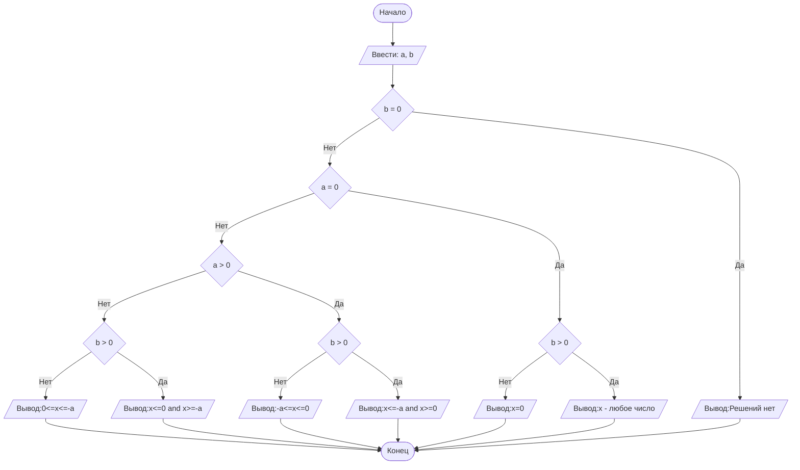

## Отчет по лабораторной работе № 1

#### № группы: `ПМ-2402`

#### Выполнила: `Трофимова Виктория Алексеевна`

#### Вариант: `26`

### Cодержание:

- [Постановка задачи](#1-постановка-задачи)
- [Входные и выходные данные](#2-входные-и-выходные-данные)
- [Выбор структуры данных](#3-выбор-структуры-данных)
- [Алгоритм](#4-алгоритм)
- [Программа](#5-программа)
- [Анализ правильности решения](#6-анализ-правильности-решения)

### 1. Постановка задачи

> Дано неравенство: (x(x+a))/b>=0 
> Где a и b — параметры (вводятся с клавиатуры). Решите его для x.
>
1. Ввод двух чисел с терминала
2. Обработка всех возможных пар a, b
3. Вывод ответа

Заметим, что b никогда не будет равно нулю, так как находится в знаменателе, а в ответе часто будет фигурировать коэффициент а с противоположным знаком.
После рассмотрим все пары a и b.

### 2. Входные и выходные данные

#### Данные на вход

Ограничений в условии нет, поэтому числа ограничиваются только границами типа данных double.

|             | Тип                | min значение | max значение |
|-------------|--------------------|--------------|--------------|
| a (Число 1) | Вещественное число | -1.7е-308    | -1.7е+308    |
| b (Число 2) | Вещественное число | -1.7е-308    | -1.7е+308    |

#### Данные на выход

Во время вычислений число не меняется, поэтому минимальные и максимальные значения при выходе такие же, как при входе. Тип данных сохраняется тот же.

|       | Тип                  | min значение | max значение |
|-------|----------------------|--------------|--------------|
| Ответ | Вещественное число   | -1.7е-308    | -1.7е+308    | 

### 3. Выбор структуры данных
Так как в условии нет уточнения о том, какие значения имеют параметры a и b, то мы можем догадаться, что они могут принимать абсолютно любые значения. Соответственно, мы понимаем, что необходимо использовать тип double, который не имеет ограничений.

### 4. Алгоритм

#### Алгоритм выполнения программы:

1. **Ввод данных:**  
   Программа считывает два любых числа, обозначенных как `a` и `b`.

2. **Рассмотрение исключений:**  
   Если b=0, то программа выводит на экран "Решений нет", потому что знаменатель не может быть равен нулю.

3. **Анализ пар a и b:**
   Если b!=0, то программа совершает следующие действия: рассматривает все возможные случаи a и b:
   - a=0,b>0
   - a=0,b<0
   - a>0,b>0
   - a>0,b<0
   - a<0,b>0
   - a<0,b<0
4. **Вывод результата:**
   На экран выводятся значения x в зависимости от значения параметров a и b.
#### Блок-схема


### 5. Программа

```java
import java.io.PrintStream;
import java.util.Scanner;
public class Main {
   public static Scanner in = new Scanner(System.in);
   public static PrintStream out = System.out;
   public static void main(String[] args) {
      //Вводим два числа с клавиатуры (задаем параметры a и b)
      double a = in.nextDouble();
      double b = in.nextDouble();
      //Проверяем ограничения (b не должно быть равным нулю, так как является знаменателем)
      if (b == 0) {
         // Если b=0, то неравенство не имеет значений
         out.print("Решений нет");
      }
      // Анализируем, какие значение будет принимать x, если a=0 и b>0
      else if (a == 0) {
         if (b > 0) {
            //Если a=0,a b>0, то в числителе будет x^2, а это уже означает, что числитель больше или равен 0,
            // отрицательным быть он не может;в знаменателе положительное число, следовательно, x может быть любым
            // числом.
            out.print("x - любое число");
         } else {
            //Если a=0, а b<0, то в числителе будет x^2(аналогично предыдущему случаю), а в знаменателе
            // отрицательное число, следовательно, чтобы неравенство было больше или равно нулю, то x
            // может принимать лишь одно значение - 0.
            out.print("x=0");
         }
      } else if (a > 0) {
         if (b > 0) {
            //Если a>0, b>0, то x может принимать значения до противоположного значения параметра a (включительно)
            // и после 0(включительно), так как если брать значение в промежутке (-a;0), то числитель будет
            // отрицательным, а знаменатель - положительным, следовательно, дробь будет отрицательной, что
            // противоречит условию.(Например a=2,если взять x=-1, то в числителе будет -1. Мы знаем, что
            // знаменатель положительный. Выходит, дробь - отрицательная)
            out.print("x<=" + -a + " and x>=0");
         } else {
            //Если a>0, b<0, то x может принимать значения от противоположного значения параметра a до 0 (оба
            // включительно). Так как знаменатель у нас отрицательный, следовательно, числитель должен быть меньше
            // или равен 0 (тогда сохранится условие, что дробь больше или равно нулю), а числитель может быть
            // меньше или равен нулю, только если x в промежутке [-a;0].(Например a=2, а x=-3, тогда числитель
            // равен 3. Так как знаменатель отрицательный, следовательно, и дробь отрицательная,
            // что противоречит условию. Аналогично, если взять x>0: a=2,x=1, числитель: 3>0)
            out.print(-a + "<=x<=0");
         }
      } else if (a < 0) {
         if (b > 0) {
            //Если a<0, b>0, то x может принимать значения до 0(вкл.) и после -a. Знаменатель является
            // положительным, следовательно, числитель тоже должен быть положительным (или равен нулю).
            // Так как a<0, то значение x может быть отрицательным (тогда в числителе выйдет произведение двух
            // отрицательных множителей, что в итоге даст положительное значение), нулю (тогда в числителе будет 0)
            // или больше или равно -a (при -a в числителе 0, при >(-a) числитель будет положительным: a=-3, x=4;
            // числитель: 4(4-3)=4, 4>0).
            out.print("x<=0 and x>=" + -a);
         } else {
            //Если a<0, b<0, то x может принимать значения на промежутке [0,-a]. Знаменатель является отрицательным,
            // значит числитель должен быть тоже отрицательным(или равен нулю(при x=0 или x=-a)). Отрицательным он
            // будет в промежутке (0;-a). (Например: a=-2, x=1; числитель: 1(1-2)=-1.А если взять x=3, то числитель
            // будет положительным(аналогично, если взять x<0)).
            out.print("0<=x<=" + -a);
         }
      }
   }
}
```

### 6. Анализ правильности решения

Рассмотрим все случаи значений пары a,b

1. a=0, b=0

    - **Input**:
        ```
        0 0
        ```

    - **Output**:
        ```
       Решений нет
        ```

2. a>0, b=0:

    - **Input**:
        ```
        1 0
        ```

    - **Output**:
        ```
        Решений нет
        ```

3. a<0, b=0:

    - **Input**:
        ```
        -1 0
        ```

    - **Output**:
        ```
        Решений нет
        ```

4. a=0, b>0:

    - **Input**:
        ```
        0 1
        ```

    - **Output**:
        ```
        x - любое число
        ```

5. a>0,b>0

    - **Input**:
        ```
        1 1
        ```

    - **Output**:
        ```
        x<=-1 and x>=0
        ```
6. a<0,b>0

   - **Input**:
       ```
       -1 1
       ```

   - **Output**:
       ```
       x<=0 and x>=1
       ```
7. a=0,b<0

   - **Input**:
       ```
       0 -1
       ```

   - **Output**:
       ```
       x=0
       ```
8. a>0,b<0

   - **Input**:
       ```
       1 -1
       ```

   - **Output**:
       ```
       -1<=x<=0
       ```
9. a<0,b<0

   - **Input**:
       ```
       -1 -1
       ```

   - **Output**:
       ```
       0<=x<=1
       ```
10. Попробуем ввести не целые числа. a>0,b<0.

   - **Input**:
       ```
       2,39 -4,87
       ```

   - **Output**:
       ```
       -2.39<=x<=0
       ```
